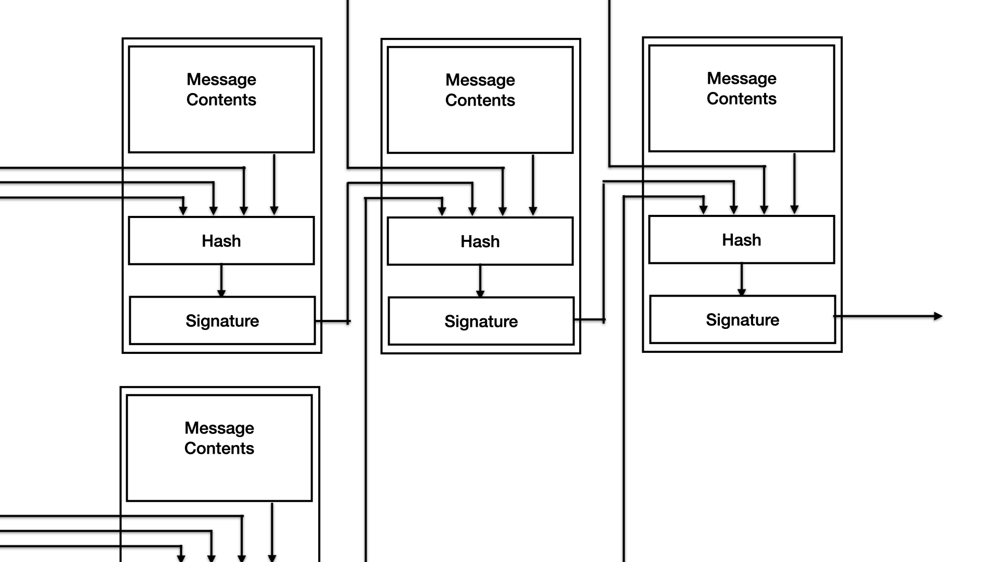
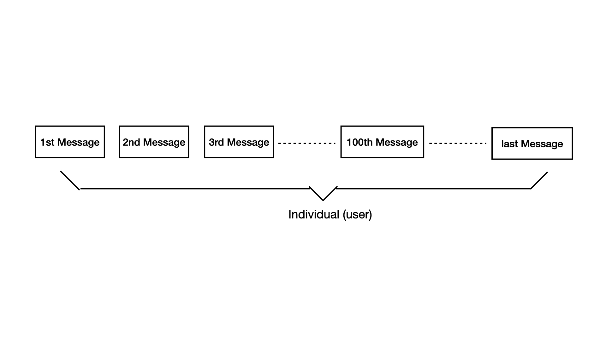

# PDU：A peer-to-peer social networking service

* App beta: [https://testflight.apple.com/join/FqQGxhbn](https://testflight.apple.com/join/FqQGxhbn)
* github: [github.com/pdupub](https://github.com/pdupub)
* email: pdupub@gmail.com
* wechat: pengpengt00
* telegram: [@PDUPUB](https://t.me/pdupub)
* telegram group: [@PDUGroup](https://t.me/pdugroup)
* twitter: [@PDUPUB](https://twitter.com/pdupub)

**Abstract:** This paper proposes a social network system that can be implemented in a peer-to-peer network environment, which enables any user to freely publish information, and at the same time realizes the number of information publishers without third-party authentication. limited controllability. Digital signatures can guarantee the authenticity, integrity and non-repudiation of information, but since the key itself has no creation cost, when there is no third-party organization to verify and associate the digital signature with the user identity behind it, the system will be flooded with a large number of robot accounts, Make account-based penalty mechanisms useless. We propose a new solution to build social network services based on peer-to-peer and help users to effectively screen information publishers without relying on third-party authentication. All messages in the system determine the ordered relationship through mutual reference, and then determine their source by signature. Homologous total order message sequence is regarded as an information publisher identity, and all messages in the system can constitute one or more message sets with partial order relationship. Any information publisher is free to create a new species or identify other identities as belonging to a certain species. The user constructs the species range based on the obtained species identification information, and further filters suspicious information publishers according to the identification relationship. This process changes the unified verification and consistent user range in centralized services into a scalable species-based identity range determined by users themselves.

<!-- MarkdownTOC depth=4 autolink=true bracket=round list_bullets="-*+" -->
- [Introduction](#introduction)
- [Message](#message)
  * [Reference List](#reference-list)
  * [Message Content](#message-content)
  * [Message Signature](#message-signature)
- [Publisher Identity](#publisher-identity)
- [Species](#species)
  * [Species Establishment & Expansion](#species-establishment-and-expansion)
  * [Screening within Species](#screening-within-species)
- [Node](#node)
  * [User Node](#user-node)
  * [Service Node](#service-node)
- [Privacy](#privacy)
- [Organization, Administration, Currency](#organization-administration-currency)
  * [Organization](#organization)
  * [Administration](#administration)
  * [Currency](#currency)
- [Summary](#summary)
- [Appendix](#appendix)
<!-- /MarkdownTOC -->

## Introduction
The information dissemination system should allow users to freely publish and disseminate information, and at the same time obtain information effectively. Since information is usually organized according to its source, the effective acquisition of information must be based on two conditions, that is, the source can be determined and the source is limited.

In the process of word-of-mouth transmission of information, we can know who the information comes from when we talk face-to-face, but the actual contact range in life limits the number of information sources. The invention of writing expanded the boundaries of information dissemination in two dimensions of time and space, but did not break the limitations of the above two conditions.

Today, many social service platforms have provided unprecedented help for the efficiency of information dissemination and the convenience of use. Through identity authentication methods such as mobile phone numbers and email addresses, the platform can effectively limit the creation of virtual identities to maintain the limited information sources. But while providing services, the impact of the platform itself on information dissemination is becoming more and more serious. Such as restricting user permissions, blocking speech, or using the recommendation mechanism to expand the spread of specific topics. We do not deny the positive significance of the guidance of public opinion on some specific events, but we hope to believe that every participant in the process of information dissemination will hand over the judgment of right and wrong to everyone, rather than a single center.

In this paper, we propose a peer-to-peer social network system, which is based on a specific form of information organization, enabling system users to freely publish and disseminate information, and to achieve limited information sources without the intervention of third-party authentication. , so as to ensure that users can achieve the purpose of effectively obtaining information by filtering information sources. Instead of imposing a uniform cost on the process of creating identities in the system or limiting the total number of identities in the system, the scheme leaves the organization of identities up to all consumers in the system. Users expand the species they belong to based on their self-identity, and select one or more species in the system as their visible information sources according to their wishes.

## Message
In the system described in this paper, the message is the smallest unit and the only form of information transmission content between point-to-point. We define that each message must contain three parts, reference list, content and signature.

### Reference List
Reference lists contain the signatures of other messages and are used to establish relationships between messages. Because the probability of signature collision is very low, we can consider that the message corresponding to the signature in the reference list was created before the current message.

If the signed private key has signed other messages before, the system requires that the first bit in the current message reference list must be the signature of the last message previously signed by the same private key, which is called self-reference. If the private key has not been used in the system, the first bit of the current message reference list is null. In this way, all messages of the same source have a clear and provable contextual relationship, which can form a fully ordered queue.

In addition to self-references, the reference list can contain any other signatures. In actual use, it is recommended to include at least one newer message signature in the list. The purpose is to give the current message a relatively accurate timing in the overall system. verifiable scope.

The information acquirer is not obliged to know all the messages in the system, so the message publisher will not be punished because there are unknown signatures in the reference list. But if it gets different messages with the same self-reference, it means that the publisher has broken the total order restriction of its own messages, and this publisher should no longer be regarded as a legal identity, and all subsequent messages will be blocked.

### Message Content
The message content is the main part of the message, consisting of a message type and multiple content fragments. Currently the system includes the following 5 types:

* **Information**: the most important message type, used to publish information. The content can include content fragments in different formats such as text, pictures, audio and video.
* **Integration**: This type of message is mainly used in scenarios where the final state needs to be simply presented, such as adding or changing identity attributes or user ledger records.
* **Specification**: used to create a species.
* **Identification**: used to express the recognition that other publishers belong to the species.
* ***Termination**: It is used when you actively want to ignore subsequent messages due to private key disclosure or other reasons.

### Message Signature
All messages in the system must contain signatures to identify their origin and ensure the integrity of the message content. The signature will also be put into other subsequent messages to express the ordered relationship between the messages.

The figure above shows the construction and reference relationship of each message.

## Publisher Identity

In common centralized social network services, the user identity usually represents the identity of the information publisher and the identity of the information acquirer. Relying on this identity definition, the user can either block the messages sent by this user, or block his own messages, and the propagation direction of any message is determined by both the sending and receiving parties. In contrast, in the peer-to-peer system described in this paper, since all messages are public, the process of dissemination is only determined by the information acquirer. The identity in the system is also defined as an information publisher identity that is completely visible to others, stripping away the logical attributes related to information acquisition.

As mentioned earlier, in this system, a fully ordered message queue signed by the same private key is considered as an information publishing identity. It has a one-to-one correspondence with the private key, but the two are not equivalent. We believe that the identity of the information publisher in the system represents an independent subject with the sole purpose of maximizing information dissemination, represented by a series of messages with a total order relationship, and the smallest unit that can perceive the impact of external rewards and punishments and modify its future behavior. The same private key makes this identity identifiable, and the total order makes its subsequent message propagation degree can be affected by the previous message.

At present, we have defined the message in the system, which is the basic unit of point-to-point transmission of information, and the identity of the publisher who can bear rewards and punishments, but we have not uniformly verified the identity like the centralized platform. Although all messages in the system can be identified based on their signatures, users still have no choice but to face unlimited publishers.

## Species
We have defined the publisher identity, but in a peer-to-peer environment, anyone can easily create any number of keys, organize the information and add signatures as described above. In the absence of three-party authentication, there will still be a large number of robot accounts in the system. There is nothing we can do to prevent this from happening while guaranteeing the free release of information. But it needs to be clear that our goal is not to ensure that the publishers of the system as a whole are limited, nor to allow each user to have the same range of visible publishers, but to provide users with a way to see the number of publishers limited.

To achieve the above goals, we propose the concept of "species". Just as identities are considered as a clustering of messages, species can be thought of as a clustering of identities. We can simply understand the affiliation of the species as what the publisher is, rather than the hobby or characteristics of the publisher. For example, we belong to the species of humans, the species of primates, and the species of earth creatures.

### Species Establishment and Expansion

The establishment of each species is based on a certain commonality among individuals, and the recognition of the existence of this commonality comes from the individual's self-identity. The process of joining a species is the process of being accepted by the species, which is a passive process for newcomers. Each publisher in the system can publicly establish a species through the specification message, and can also identify a publisher as belonging to a species through the identification message, so as to expand the size of the species.

In a peer-to-peer system, we hope that users receive and process information that is meaningful to them, rather than the full amount of information. Therefore, apart from the total order of homology, there is no rigid requirement for logical judgment between information. For example, it is not required that an identity must first belong to a certain species before it can send identification message to other identities. We leave this freedom of judgment to system users, who can decide their own judgment rules based on visible information.

### Screening within Species

As mentioned above, the publisher identity in the system has stripped away the relevant logic of information acquisition, but in the process of using the system, especially in the process of obtaining information, it is still necessary to build an acquisition logic to ensure that the information sources are limited. Users can find the species they belong to through the existing associations, such as the publishers associated when they first entered the system, and arbitrarily select one or more as the current visible range. You can also explore more species through the publishers in the species, and finally determine which species to limit your visibility.

Users within this species can also filter according to the identified relationship between users. For example, if A is judged as a suspicious user and believes that his purpose is to introduce more suspicious users into the species, he can set all his identification messages to be invalid for himself, thereby filtering all the offspring introduced by A in this species. This process does not directly filter out users identified by A, because A may also identify identities that are also identified by other publishers, so it is only necessary to eliminate the influence of A in this species expansion. In actual use, due to the limitation of the amount of local information of the user, for a larger species, the scope can also be defined by the user to filter the rules, and let the service node calculate it on its behalf.

Although the number of ethnic species is also unlimited, with the development of the system, due to the good development, the minority species will have agglomeration effect and develop into larger species. At this time, the user's demand for the change or increase or decrease of the species will not be too strong. The main task of screening will become the screening and judgment of new entrants in the species.

## Node

A node is a physical meaning, usually corresponding to a device or a network service, we simply divide the node into a user node and a service node.

### User Node

User nodes usually refer to terminal devices such as mobile phones and computers of users. Consumers should usually save complete message sequences on at least one of their own user nodes to provide to other nodes when necessary. Other nodes are not obliged to keep such information completely. As an information acquisition device, a user node usually retains its own set of user-limited rules, such as the selected species and filtering rules within the species, for the convenience of users. Users are not obliged to provide this rule to others.

### Service Node

Service nodes are usually similar to current third-party network services, the difference is that they are built on public public information. It can provide basic services such as data storage and retrieval. It should be noted that the service node has no obligation, and it is impossible to contain the full amount of information of the system. It is not essentially different from the user node, and can also filter the user's visible range according to the rules defined by itself. The only difference is that the range of visible species may be wider, and the stored information is more abundant and durable.

All the messages stored on the nodes can form one or more directed acyclic graphs (DAG). The position of messages in the graph is determined according to their mutual reference relationship. Multiple DAGs may be merged due to new information, or a piece of information may be judged invalid, resulting in the division of DAG.

## Privacy

All content in the system is public. The private content can be based on the secret key corresponding to the identity of the publisher, but the private content can be considered as not belonging to the system, and this is not the problem that the system tries to solve.

Any message that is propagated leaves traces in some way, possibly stored by some nodes, or referenced by other messages. And information that leaves no trace, because it does not have any impact on the system, it is tantamount to non-existence. The speed and breadth of information dissemination depend on the information itself. The so-called privacy is only a temporary and unguaranteed assumption that the degree of publicity is limited. The consequence is often not the secrecy of the information, but the continued diffusion of the distorted information.

The preference to protect privacy comes from the inertia of thinking, but we believe that injustice comes from the fact that not all information is fully disclosed to the same degree. In reality, only part of the individual's information can be known to another part of the individual, and vice versa. However, the real privacy is only the information that has never been expressed in the individual's heart, which does not require any system to protect it in any form. And the information that is public and has been disseminated should be accurately recorded and made public.

## Organization, Administration, Currency

### Organization
The organization in the system refers to a higher form of individual based on the publisher, which is usually presented as a total sequence according to certain rules. This total order can be customized according to the needs of use.

For example, several publishers jointly form a newsgroup, and they can use the second bit of their reference list as the ordered association bit of the newsgroup, and each publisher among them can still freely publish in the system according to the original rules For other content, only the signature of the previous news of this newsgroup can be quoted in the second place in the reference list when publishing newsgroup-related content.

Unlike the concept of species, organizations are not necessarily the underlying structure of the system. An organization is like a family or a company in reality. It is a social organizational structure that can organize individuals to varying degrees and present it as a whole externally. A species is a collection of individuals.

In this completely decentralized system, we can already replicate most of the social organization forms in the real society.

### Administration
The system realizes the limited number of publishers in the species, so the species can be managed by common methods such as voting. However, it should be noted that voting requires an organization or identity to assist in confirming the scope of visible publishers. The process is similar to voter registration prior to an election to draw the line.

The punishment in the real society is to weaken the influence of a single individual on the public by means of physical isolation by the authority. There is no centralized authority in the peer-to-peer system, so there is no mandatory punishment, but the service node can choose how to process the information of a certain publisher, whether to store or transfer it, according to its own rules. When developing a specific application, the application can also define its own service node rules according to its own platform and regional laws and regulations, and select suitable users and their information from the system.

### Currency
We can implement a centralized currency in this decentralized system, or we can implement a decentralized currency based on the known multiple encrypted currency consensus methods. However, in actual use, considering the limited identity and work efficiency within the species that the system itself has achieved, we prefer to use voting-related mechanisms rather than pure proof-of-work methods to achieve cryptocurrency consensus, such as DPoS consensus.

The blockchain can be regarded as an organization within the system, composed of multiple identities, and presented as a fully-ordered message queue, that is, a higher-level individual. Various consensus rules determine how subsequent messages in this totally ordered sequence are selected.

## Summary

We propose an identity construction method that does not rely on centralized authentication. Pure digital signatures can identify identities, but they cannot prevent the impact of robot account creation on the system. To solve this problem, we define the format of the message so that there must be a relationship between the messages and define the total order homology as identity. Based on self-identity, each publisher identity can create and expand communities. Based on specification and identification messages, users can arbitrarily select species to form a limited set of publishers and further filter the visible set according to the identified relationship between publishers. Because all users can spread the news according to their own wishes, high-quality content will attract more attention to the identity of the publisher, which will facilitate the wider dissemination of its follow-up information. On the contrary, although low-quality content may still be created in large quantities , but loses meaning because it cannot be disseminated, and will not have a serious impact on system users. This article also clarifies the attitude about privacy, which can be realized based on the identity of the publisher, but it cannot be used to determine the identity, and it does not belong to this system.

## Appendix

* [go-pdu](https://github.com/pdupub/go-pdu)
* [iOS App beta](https://testflight.apple.com/join/FqQGxhbn)

[back](../../)

