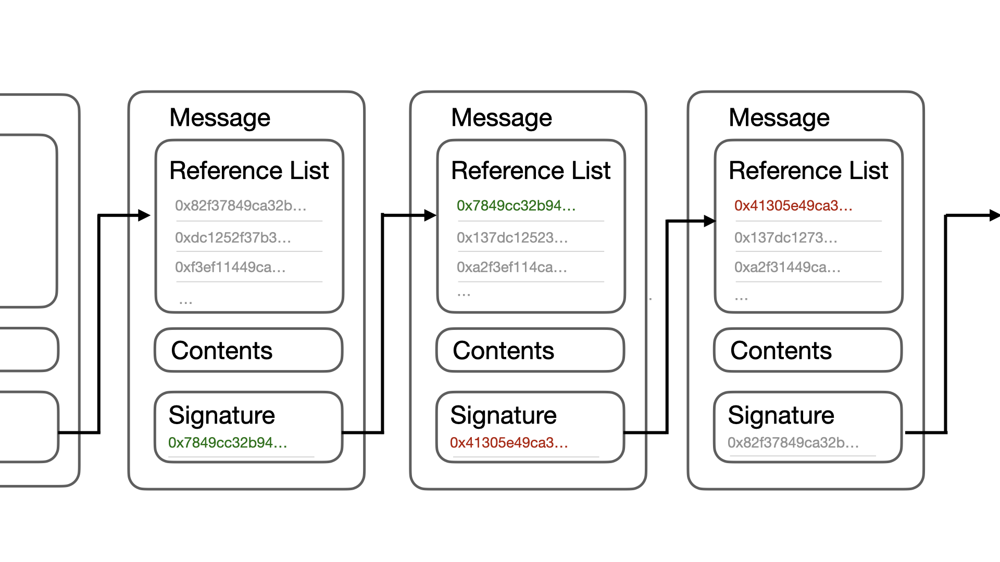

# PDU Protocol：A Peer-to-Peer Social Network Service

* iOS App: [https://apps.apple.com/us/app/p-d-u/id6443928730](https://apps.apple.com/us/app/p-d-u/id6443928730)
* github: [github.com/pdupub](https://github.com/pdupub)
* telegram: [@PDUPUB](https://t.me/pdupub)
* telegram group: [@PDUGroup](https://t.me/pdugroup)
* twitter: [@PDUPUB](https://twitter.com/pdupub)

**Abstract:** A fully peer-to-peer (P2P) social networking system should enable participants to freely publish and efficiently access information without relying on any third-party services. However, if the system does not employ centralized verification methods, such as phone numbers, allowing the cost-free creation of new accounts, it becomes susceptible to Sybil attacks. This vulnerability undermines the system’s reward and punishment mechanisms, inundates genuine content with spam, and renders the system unusable. This paper proposes a solution for constructing a P2P social network without relying on any third-party user authentication services. The scheme establishes a trusted publisher identity through a sequence of messages signed by the same private key. Interactions such as reposts, comments, and likes create associations between publishers. Based on these associations, participants can form a custom set of visible publisher identities. Within this relatively stable scope, an identity-based reward and punishment mechanism can be employed to effectively filter information.

<!-- MarkdownTOC depth=4 autolink=true bracket=round list_bullets="-*+" -->
- [Introduction](#introduction)
- [Messages](#messages)
- [Publisher](#publisher)
- [Visible Identity Set](#visible-identity-set)
- [Network](#network)
- [Incentives](#incentives)
- [Blockchain](#blockchain)
- [Privacy](#privacy)
- [Third-Party Services](#third-party-services)
- [Conclusion](#conclusion)
- [References](#references)
<!-- /MarkdownTOC -->

## Introduction

In today's online ecosystem, information dissemination and interaction primarily depend on centralized platforms like Facebook, Twitter/X, and WeChat. These platforms allow users to conveniently post information and establish connections, using various algorithms to detect and filter spam, thus ensuring user experience. However, the problems of centralized social services have become increasingly apparent. Third-party services may misuse user information or leak private data. They might leverage their extensive user base to lock in users and maintain their monopoly. Additionally, centralized services are prone to government regulation and censorship due to their clear and controllable targets.

Despite these issues, most users continue to rely on these existing platforms. While switching platforms does not result in data loss, it does lead to the loss of accumulated user relationships on the platform, thereby diminishing one's influence[^1]. This lock-in effect significantly binds users to the platforms.

Decentralized social platforms have rapidly developed in recent years, attempting to address many issues posed by centralized platforms, exemplified by Mastodon. Mastodon employs a federated architecture[^2], eschewing a single center in favor of multiple intercommunicating servers, allowing users to retain control over their relationship data. However, the user registration process and content management still depend on server administrators. This governance structure can be seen as a collection of several small centralized platforms, failing to fundamentally avoid the issues faced by centralized platforms.

Blockchain-based social platforms like Steemit[^3][^4] and Minds[^5] implement a certain number of tokens as the cost to create or activate accounts, while also incentivizing social behaviors with tokens. Although this approach increases the cost of account creation, it differs from the identity verification methods of centralized platforms. This method cannot effectively prevent the proliferation of fake accounts and imposes unfair restrictions on economically disadvantaged users, thus reducing the diversity and inclusiveness of the user base.

Some social software initially employs an invitation system to control the credibility of new users, effectively preventing malicious registrations and the spread of fake accounts. However, this approach also hinders the participation of a broader user base. For those who do not know existing users, joining the platform becomes exceedingly difficult. Moreover, early users significantly influence the community culture and rules, potentially leading to cultural homogeneity and difficulty in attracting a diverse user group.

This paper proposes a novel peer-to-peer social networking system that does not rely on any third-party services. Any sequence of messages signed with the same private key and possessing a total order is recognized by the system as a legitimate publisher identity, ensuring the immutability of information and providing a fair assessment of publisher identities. Through interactions among messages, public associations between publisher identities can be formed, viewed as trust relationships among users. Any user can maintain a visible set of publisher identities based on these associations, using custom rules, and within this scope, effectively filter information using publisher identities as markers.

## Messages

Messages are defined as the basic data structure within the system and are the sole type of information transmitted in the peer-to-peer network. Other data types in the system, such as publisher identities, are autonomously generated by each node based on this public data.

As shown in Figure 1, each message consists of three parts: message content, a reference list, and a signature. The message content is the main body of the message, divided into content information and interaction types. The former includes multimedia content such as text and images, while the latter encompasses common social network interactions like posting, replying, quoting, and liking. The reference list may contain the signatures of multiple messages, indicating the temporal relationship between the current message and the referenced messages. When the message content involves interactions like replies or quotes, the signatures of the related messages should also be included in the reference list. For more precise temporal verification, it is recommended to include at least one signature of the most recent message in the reference list. Finally, the message content and reference list are merged to calculate a hash value, which is signed using the current publisher’s private key to confirm the publisher's identity and ensure data integrity.

Although each message has explicit content, it is often impossible to determine if a message is spam based solely on the message itself. For instance, messages like "Recommend trying restaurant A on M Street" or "Advise everyone to avoid restaurant B on N Street" might seem fine individually. However, if thousands of similar messages appear in a short time, they are deemed spam and malicious manipulation. In centralized platforms, all user actions are recorded by the platform. Even if users delete their content afterward, the platform's algorithms capture the malicious content and restrict or ban the accounts that posted it, ensuring that malicious behavior is punished and legitimate content is not overwhelmed.

Therefore, a method is needed to access all information posted by an account when necessary and ensure that the posted content has not been tampered with. This helps in evaluating the publisher to determine whether their content is legitimate and if they need to be blocked to reduce spam. Additionally, an effective publisher filtering mechanism is required to ensure that malicious publishers cannot simply switch private keys to continue their behavior after being penalized.

## Publisher

To accurately assess accounts, we need to ensure that the content published by the accounts has not been tampered with and can be detected even if the publisher deletes the messages. In a peer-to-peer distributed system, this feature is implemented by requiring the content published by each account to form a blockchain-like linked list structure[^6]. It is stipulated that the first entry in the reference list of each message must be the signature of the previous message signed by the same private key, as shown in Figure 2. If the current message is the first message signed by this private key, the first value in the reference list is 0, indicating the starting point.

In blockchain systems, forks in the main chain occur due to computational competition among miners rather than malicious behavior. Therefore, the system does not penalize miners for forks but instead achieves consensus through a consensus mechanism. In this system, since signatures cannot be forged, if a publisher's message linked list forks, it is considered intentional modification of historical data by the publisher, which is subjective malicious behavior. Except for the first message, if the first signature in the reference list points to a message signed by a different private key, it is also considered subjective malicious behavior. In both cases, the publisher should be penalized.

If the first message in the reference list has not yet been received, the message should be temporarily stored, and neither trusted nor the publisher penalized. The publisher is responsible for maintaining a complete message chain signed by themselves to provide verification in case any message is lost in the network.

Another scenario is where the publisher may hide a forked message chain, waiting until multiple messages in one fork have been received before publishing messages from another fork into the system. In such cases, the already accepted messages in the system will be considered established facts. Punishment for the publisher typically involves discarding the later-received messages in the conflicting part and blocking the publisher. This punitive approach renders fork attacks meaningless.

## Visible Identity Set

The message chain composed of signed messages ensures that any attempt by a publisher to tamper with previously published content can be easily detected by others. Therefore, relying on this data structure allows for a fair evaluation of the information publisher. However, if a malicious publisher can replace their signing private key at zero cost after being blocked, it renders the punishment mechanism ineffective.

Traditional centralized platforms typically require verification methods, such as phone numbers, to create user accounts, thus linking the user's real identity to the creation of a virtual identity. Some decentralized identity systems, such as Sovrin[^7], also adopt similar methods. While this approach is relatively reasonable, it necessitates verification by a trusted third party. Some blockchain-based social systems[^4] charge a certain number of tokens as the cost of creating an account. However, due to varying financial statuses among users, it is challenging to find a fair price that attracts user participation while curbing the creation of spam accounts.

Relevant research[^8-^10] indicates that analyzing user interaction behaviors can effectively compute trust relationships between users. This interaction-based trust evaluation method demonstrates high accuracy in social systems, helping to identify and exclude fake accounts, thereby effectively preventing Sybil attacks. In a peer-to-peer distributed system, all information is based on public messages. These messages inherently include interactions such as comments and likes between publishers. Starting from any publisher identity, we can construct multiple sets of trusted publishers based on different trust relationship thresholds through their interactions. Additionally, trust relationships between users are transitive[^11]; if a user is deemed trustworthy by others, third parties with trust relationships with that user are also considered trustworthy. Consequently, we can further identify and include publishers interacting with those in the resultant sets, gradually expanding the number of identities in the visible user set.

It is important to note that the visible identity set is not equivalent to the traditional "following" feature on centralized platforms but is more akin to a platform user set defined by the user themselves. Only the identities within this range will have their published information visible to the user. This visible user set can be expanded directly by the user or automatically adjusted by defined algorithms. For example, if a user interacts with another user, the latter's identity is added to the visible identity set. Conversely, when an identity is determined to be a spam publisher, the identity that introduced it to the visible identity set can also be blocked.

When establishing the visible identity set, if a user has one or more publisher identities, the expansion of the visible set typically starts from these identities, although these identities are not fundamentally different from others in the expansion process. There is no inherent binding between publisher identities and the visible user set.

The visible user set can be regarded as a custom rule by which users incrementally calculate their visible user range based on public information. However, in a peer-to-peer distributed system, the system does not guarantee that users can obtain complete information. Thus, even if the same algorithm is used, the final visible identity set may vary.

Due to the existence of the visible user set, although a malicious publisher can switch private keys at zero cost to publish information under a new identity, the new publisher identity will not be readily accepted by other users, thereby reducing the spread of spam and mitigating the impact of Sybil attacks. Even if an identity has not published any spam, consistent interaction with penalized publishers may lead to its removal from the user's visible identity set.

## Network

A decentralized network consists of numerous nodes, each generating a relatively fixed hash value for identification. Nodes filter the received messages based on their customized sets of visible identities. There is no binding relationship between information publishers and node addresses, nor are publishers restricted by the visible identity sets. Publishers can interact with any message, regardless of the originating node or publisher. Whether a new message is accepted by a node depends solely on whether the publisher of the signed message is within the node's visible identity set, independent of the original message.

When an identity is accepted by only a few nodes in the network, due to the peer-to-peer nature of message transmission, many nodes that accept this identity might still be unable to receive new messages because of filtering by other nodes. In such cases, the dissemination range of the information may be limited, resulting in reduced impact. However, interactions such as comments, reposts, quotes, and likes can indirectly expand the dissemination range of the messages. High-quality messages can gradually extend their influence and dissemination range through these interactions, leading to wider acceptance of the publisher by more nodes.

This dissemination mechanism helps achieve a balance and optimization in information spread. Although some messages may have limited initial reach, high-quality content can break through these initial constraints through various forms of interaction within the network, expanding its coverage and ultimately spreading across a broader range of nodes.

## Incentives

In a social network, the measure of an information publisher's benefit is the extent of information dissemination. It can be considered that the publisher's sole purpose is to maximize the spread of their information. Therefore, the incentive in this peer-to-peer distributed network is to help publishers expand their information dissemination, while the punishment is to reduce it. Unlike decentralized systems represented by blockchain, social networks do not have a system-wide consensus, nor do they have a unified system for incentivizing or punishing a publisher's identity. Incentives are reflected through the statistical results of all information recipients' behaviors.

When a publisher consistently produces high-quality content, their content is more likely to be interacted with by other publishers. Through these interactive messages, the current publisher's content has a greater probability of being accepted by nodes that have not yet included the publisher's identity in their visible identity set. As more nodes accept the identity, the number of nodes that directly receive the publisher's broadcast messages will increase. In this way, the future content published by the current publisher will achieve greater dissemination.

Conversely, if a publisher consistently posts spam or interacts with messages containing spam, other publishers will become less willing to interact with them. Some nodes that have already accepted the current publisher's identity might remove the address from their visible user set as a result. Therefore, the behavior and content quality of the publisher directly affect the dissemination range and influence of their information. Here, spam refers not only to content containing pornography, violence, or hate speech but also to a large volume of meaningless, repetitive information.

In summary, the incentive mechanism of the social network creates a dynamic balance of information dissemination through feedback on publisher behavior and content quality. High-quality content publishers can expand their information dissemination and influence, ultimately monetizing their influence through interactions with commercial brands. This process is similar to the advertising systems on centralized platforms, encouraging publishers to continually optimize their content quality to achieve broader dissemination and greater economic benefits.

## Blockchain

In the current system, blockchain-based cryptocurrency can be directly implemented by packaging a blockchain block into a message format, with miners acting as information publishers broadcasting it.

Unlike traditional blockchains, the identities of publishers in the social system already have inherent significance. Therefore, a more efficient consensus mechanism can be chosen, rather than solely relying on computational power. The system can use publisher identities as a substitute for staking, limiting the range of miners or validators, rather than expanding a publisher's acceptance through successful block creation, thereby avoiding distortion of the current system's incentive principles. Consensus mechanisms such as Proof of Stake (PoS), Delegated Proof of Stake (DPoS), Proof of Authority (PoA), and Avalanche are relatively suitable choices.

The implementation of cryptocurrency can also be viewed as a higher-level publisher composed of multiple publishers. The blockchain, formed by these publishers, constitutes a higher-level total order message queue. The blockchain implemented within the system can identify the total order of block messages through specific positions in the reference list.

## Privacy

In traditional centralized social networks, different access permissions are set for users to achieve a certain degree of privacy protection. However, in decentralized social networks, users need to define their identities based on public messages, requiring that all public messages must be complete and have a total order. If users choose to encrypt their messages before broadcasting them, these messages become meaningless spam to users who cannot decrypt them, preventing interaction and affecting the acceptance of the publisher's identity. Therefore, the incentive mechanism in the current system encourages all publishers to only post transparent and public information.

For communication with access restrictions similar to one-to-one or one-to-many in traditional social networks, users can use the publisher identities in the current network and encrypt the peer-to-peer communication content with the recipient's public key to protect privacy. It is important to note that this privacy-protecting communication method does not belong to the current peer-to-peer social system. Users should avoid using the system's message format to prevent being mistakenly penalized.

Although the information in the system is public, publishers can choose to keep their public key anonymous. In this scenario, the public can see the content of the publicly posted messages, but they cannot link the publisher's identity in the network to their real-world identity. This method of interrupting the flow of information can also be used to protect privacy.

## Third-Party Services
As a peer-to-peer social network system, we welcome the presence of third-party services but do not rely on any of them. Third-party services can utilize public messages within the system to offer users more efficient and convenient services, as well as provide richer ways to interact beyond the system.

| Service         | Description
|-----------------|---------------------------------------------------------------------------------------------------------------------------------------------------------------------
| Information Retrieval | Based on public messages, it maximizes the visible user range, verifies information integrity, checks for conflicts, and provides an external message retrieval interface.
| Message Delivery | Provides encrypted peer-to-peer message delivery services based on publisher identities.
| Data Statistics | Analyzes interactions based on public messages and publisher identities to compute the extent of information dissemination.
| Advertising Platform | Connects publishers with advertisers based on publisher identities and the degree of information dissemination.
| Other Services | Due to the cost associated with publisher identities, additional services such as voting can be implemented.

## Conclusion

We propose a peer-to-peer social network system that does not rely on any third-party services. First, a unified message format is defined. By using messages signed with the same private key and maintaining a total order, the system constructs publisher identities, ensuring that messages cannot be tampered with. However, if users can create new identities at zero cost, identity-based punishments will not effectively prevent Sybil attacks. To address this issue, we allow information recipients to use interaction-based algorithms to generate custom sets of visible publisher identities. Unlike traditional centralized social networks, the filtered messages in this system vary by user and do not exhibit system-wide consistency.

Publisher visibility stems from interactions between messages. High-quality content creators attract interactions from other publishers, and through the dissemination of these interactive messages, the acceptance of their identities expands. This incentive mechanism encourages publishers to continually create valuable content.

Although all messages in the system are public, users can still transmit encrypted data through external methods based on established identities. Additionally, by interrupting information flow, users can separate network identities from real-world identities, further protecting privacy.

This system can easily incorporate existing mainstream blockchain consensus mechanisms. Since identity creation incurs a cost, we can optimize certain consensus mechanisms that require staking, thereby enhancing the security and stability of cryptocurrencies and improving the user experience.

## References

[^1]: Hatamleh, I.H.M., Safori, A.O., Habes, M., Tahat, O., Ahmad, A.K., Abdallah, R.A.-Q., and Aissani, R., "Trust in Social Media: Enhancing Social Relationships," Social Sciences, vol. 12, no. 7, p. 416, 2023. doi: 10.3390/socsci12070416. Available: https://www.mdpi.com/2076-0760/12/7/416

[^2]: L. La Cava, S. Greco, and A. Tagarelli, "Understanding the growth of the Fediverse through the lens of Mastodon," Applied Network Science, 2021. [Online]. Available: https://arxiv.org/pdf/2106.15473

[^3]: Steemit, "Steem Platform Whitepaper 2.0," GitHub Repository, 2024. Available: https://github.com/steemit/whitepaper

[^4]: M. Thelwall, "Can social news websites pay for content and curation? The SteemIt cryptocurrency model," Journal of Information Science, vol. 44, no. 6, pp. 736-751, 2018. doi: 10.1177/0165551517748290. Available: https://sci-hub.ru/10.1177/0165551517748290

[^5]: B. Ottman and J. Doe, "The Censorship Effect," Minds, 2019. Available: https://cdn-assets.minds.com/The_Censorship_Effect.pdf

[^6]: S. Nakamoto, "Bitcoin: A Peer-to-Peer Electronic Cash System," 2008. Available: https://bitcoin.org/bitcoin.pdf

[^7]: D. Reed and D. Hardman, "How DIDs, Keys, Credentials, and Agents Work Together in Sovrin," Sovrin Foundation, 2018. Available: https://sovrin.org/wp-content/uploads/2019/01/How-DIDs-Keys-Credentials-and-Agents-Work-Together-in-Sovrin-131118.pdf

[^8]: G. Jethava and U. P. Rao, "An Interaction-Based and Graph-Based Hybrid Approach to Evaluate Trust in Online Social Networks (OSNs)," Arabian Journal for Science and Engineering, vol. 47, no. 8, pp. 9615–9628, 2022. doi: 10.1007/s13369-021-06332-w. Available: https://link.springer.com/article/10.1007/s13369-021-06332-w

[^9]: W. Lin, Z. Gao, and B. Li, "Guardian: Evaluating Trust in Online Social Networks with Graph Convolutional Networks," in Proceedings of IEEE INFOCOM, Toronto, Canada, 2020, pp. 914-923. doi: 10.1109/INFOCOM41043.2020.9155370. Available: https://ieeexplore.ieee.org/abstract/document/9155370

[^10]: A. Khaksari and M. R. Keyvanpour, "TP-TA: A Comparative Analytical Framework for Trust Prediction Models in Online Social Networks Based on Trust Aspects," Artificial Intelligence Review, vol. 52, no. 3, pp. 1929–1960, 2019. doi: 10.1007/s10462-017-9583-1. Available: https://link.springer.com/article/10.1007/s10462-017-9583-1.

[^11]: R. Ureña, G. Kou, Y. Dong, F. Chiclana, and E. Herrera-Viedma, "A Review on Trust Propagation and Opinion Dynamics in Social Networks and Group Decision Making Frameworks," Information Sciences, vol. 478, pp. 461–475, 2019. doi: 10.1016/j.ins.2018.11.037. Available: https://www.researchgate.net/publication/329039753_A_review_on_trust_propagation_and_opinion_dynamics_in_social_networks_and_group_decision_making_frameworks

[back](../../)

